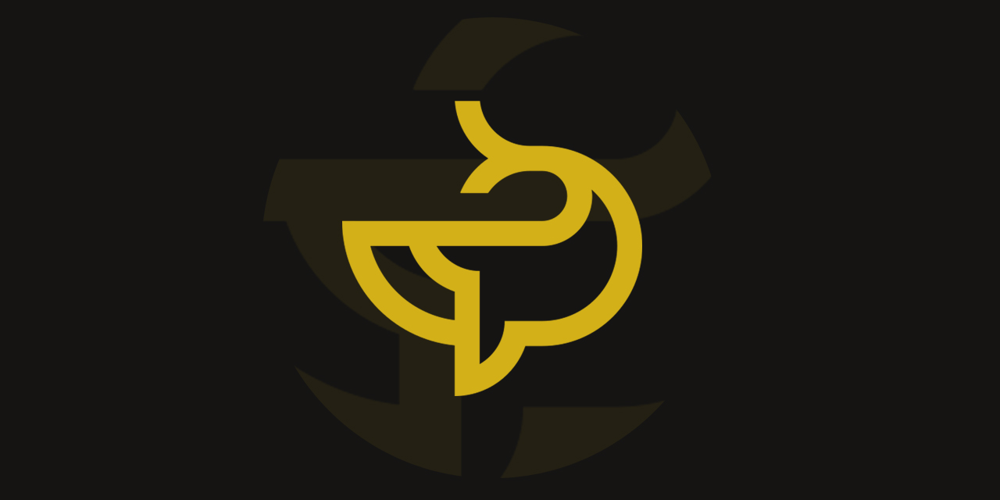

   
  <a href="https://github.com/mcpronovost/okp-oykus">Oykus</a> &mdash; where every player is both author and adventurer
    

## 📋 Code of Conduct

Please read our [Code of Conduct](CODE_OF_CONDUCT.md) to understand the standards we expect from our community.

## 🤝 Contributing

We welcome contributions!
Please see our [Contributing Guidelines](CONTRIBUTING.md) for more details on how to get involved.

## 📜 License

This project is licensed under the [BSD-3-Clause License](LICENSE).
